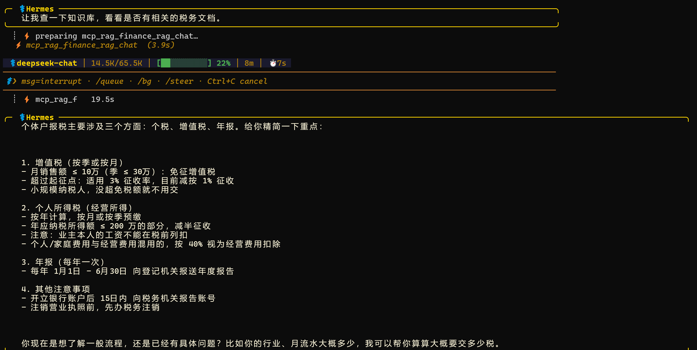
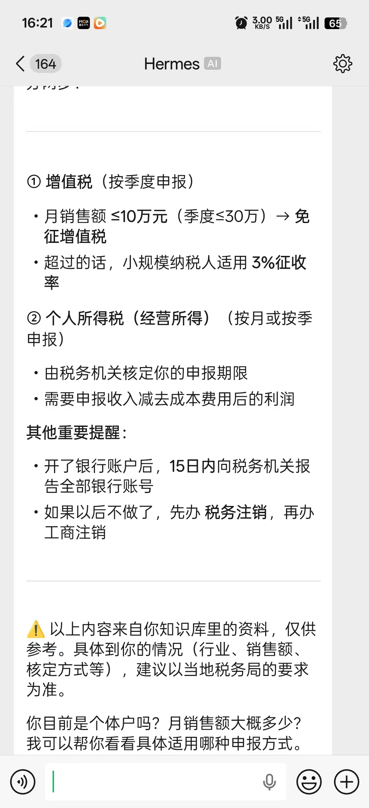
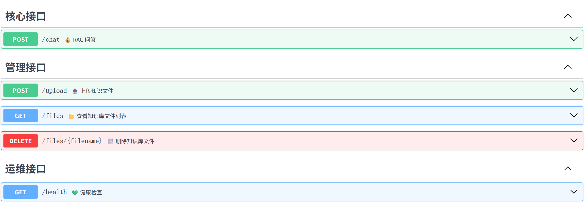
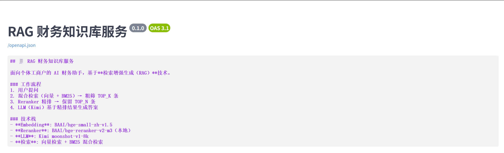
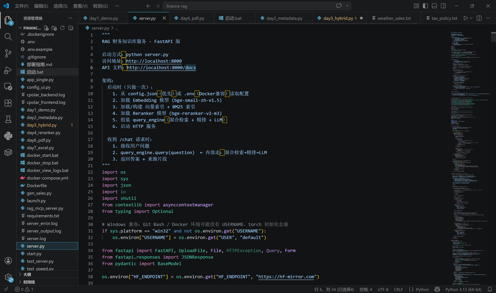

<<<<<<< HEAD
# RAG-Skeleton

> 基于 Hermes Agent + RAG + 微信的**通用 AI 知识库骨架**  
> 换一个知识库，就是一个新应用。

[](https://www.python.org)
[](LICENSE)
[]()
[]()

---

## 这是什么？

**一个可以"即插即用"的 RAG 系统骨架。**

你把某个领域的知识文件（txt / pdf / xlsx）丢进知识库，它就能在这个领域跟你专业对话。不瞎编，每条回答都有来源。

- 丢进税务文档 → 税务咨询助手
- 丢进医疗手册 → 健康咨询助手
- 丢进法律条文 → 法律咨询助手
- 丢进你的私人笔记 → 你的第二大脑

---

## 核心特性

| 特性 | 说明 |
|------|------|
| **通用骨架** | 知识库与业务逻辑分离，换领域只需替换知识文件 |
| **混合检索** | 向量检索 + BM25 关键词检索，双路并行，不漏答案 |
| **Reranker 精排** | 对检索结果二次精排，进一步提升准确率 |
| **双 LLM 模式** | 有网用 DeepSeek（质量高），断网用 Ollama（本地离线） |
| **Hermes Agent 集成** | 通过 MCP 协议接入，支持记忆、推理、多轮对话 |
| **微信直连** | iLink Bot API，扫码登录，无需公网 IP |
| **多格式支持** | txt / pdf（含表格+OCR）/ xlsx（自动生成行摘要+统计概要） |
| **完全本地部署** | 数据不出本机，隐私安全 |

---

## 技术决策

### 为什么用 LlamaIndex 而不是 LangChain？

| 对比维度 | LlamaIndex | LangChain |
|---------|-------------|----------|
| 定位 | **专注 RAG**，索引/检索/生成一体化 | 通用 LLM 应用框架，链式调用为主 |
| 上手成本 | 低，`VectorStoreIndex.from_documents()` 一行建索引 | 高，抽象层级多，概念多 |
| 混合检索 | 原生支持 `QueryFusionRetriever`（向量+BM25 合并） | 需自己组装多个 Retriever |
| Reranker 集成 | 一行 `node_postprocessors=[rerank]` 挂上去 | 需自定义 Chain |
| 结构化数据 | `pandas` + 自定义 Document 策略清晰 | 需要 `DataFrameLoader`，灵活性差一些 |
| 社区资源 | RAG 专项教程多 | 通用场景多，RAG 深度相对浅 |

**结论：** 本项目是**纯 RAG 场景**，LlamaIndex 开箱即用，LangChain 反而绕路。

---

## FastAPI 如何解决「模型加载慢」的问题？

**问题根源：**

Embedding 模型（bge-small-zh-v1.5，~130MB）和 Reranker 模型（bge-reranker-v2-m3，~2.1GB）每次 Python 进程启动都要重新加载，耗时约 **31 秒**，用户每问一次等半天。

**解决思路：**

把模型加载放到**进程启动时做一次**，之后所有请求复用同一份内存。

**FastAPI 的 `lifespan` 机制：**

```python
@asynccontextmanager
async def lifespan(app: FastAPI):
    # ← 这里写启动逻辑（只执行一次）
    # 1. 加载 Embedding 模型（~5秒）
    # 2. 加载 Reranker 模型（~10秒，Ollama 模式跳过）
    # 3. 构建向量索引 + BM25 索引（~15秒）
    # 4. 组装 query_engine
    yield
    # ← 这里写关闭逻辑（进程退出时执行）
```

**效果对比：**

| | 每次请求加载 | FastAPI 长驻（当前方案） |
|---------|-------------|----------------------|
| 首次响应 | ~31 秒 | ~31 秒（启动时） |
| 后续每次问答 | ~31 秒 | **< 2 秒** |
| 并发能力 | 无 | 支持多请求复用同一引擎 |

**关键代码位置：** `server.py` 第 306 行 `lifespan` 函数。

---

## Hermes Agent 如何判断「什么时候用 RAG」？

Hermes 本身是一个 **LLM Agent 调度框架**，它不会硬编码「什么时候调 RAG」，而是让 **LLM 自己判断**。

**完整决策链路：**

```
用户消息
    ↓
Hermes 收到消息，把所有可用工具的描述发给 LLM
    ↓
LLM 判断：这个问题需要查知识库吗？
    ├─ 需要 → 调用 rag_chat 工具（即 RAG 问答）
    └─ 不需要 → 直接回答（闲聊、数学题、通用知识等）
    ↓
rag_chat 工具 → HTTP 调用 server.py /chat 接口
    ↓
RAG 检索知识库 → 返回答案 + 来源
    ↓
Hermes 收到 RAG 结果 → 整理后回复用户
```

**MCP 协议的作用：**

`rag_mcp_server.py` 把 RAG 的 HTTP 接口翻译成 MCP 工具描述，Hermes 看到的是：

```json
{
  "name": "rag_chat",
  "description": "用知识库回答专业问题。当用户问税务、政策、经营分析时调用。",
  "parameters": { "question": "用户的问题" }
}
```

LLM 根据 `description` 自动判断**什么时候该调这个工具**。

**实际效果举例：**

| 用户问题 | Hermes 决策 | 是否调用 RAG |
|---------|---------|-------------|
| "小规模纳税人增值税税率是多少？" | 需要查专业知识 | ✅ 调用 |
| "今天天气怎么样？" | 知识库没有天气数据 | ❌ 不调用，直接答 |
| "帮我查最新税收政策" | 需要最新/专业知识 | ✅ 调用 |
| "讲个笑话" | 完全无关 | ❌ 不调用 |

**关键点：** 不需要写任何 if/else 规则，LLM 自己判断，泛化能力远强于硬编码。

---

## 当前测试状态

为验证通用性，当前知识库已覆盖**三个差异较大的领域**，均测试通过：

| 知识库内容 | 文件类型 | 测试目的 |
|-------------|----------|----------|
| 纳税政策（税务条文） | txt | 验证政策类文本问答准确性 |
| 体考政策（体育升学政策 PDF） | pdf | 验证 PDF 表格 + 文本混合解析 |
| 个体工商户营业流水（销售数据） | xlsx | 验证结构化数据的行摘要 + 统计概要 |

**结论：** 同一套骨架，换知识库无需改代码，问答质量取决于知识文件质量。

---

## 多平台接入

基于 **Hermes Agent** 作为统一调度中心，同一套 RAG 能力可同时接入多个平台：

| 平台 | 接入方式 | 状态 |
|------|----------|------|
| Web（浏览器） | Streamlit 前端，直接访问 localhost:8501 | ✅ 已完成 |
| 微信 | iLink Bot API，扫码登录，无需公网 IP | ✅ 已完成 |
| 飞书 | Hermes 原生支持，配置即用 | ✅ 已完成 |
| WhatsApp | Hermes 支持，需配置 | 待接入 |

接入方式统一通过 **MCP 协议**，RAG 侧无需任何修改。

---

## 系统架构

```
用户（微信 / 飞书 / Web）
        ↓
Hermes Agent（调度中心：记忆 + 推理 + 工作流）
        ↓  MCP 协议（stdio）
rag_mcp_server.py（MCP 翻译层）
        ↓  HTTP (localhost:8000)
server.py（FastAPI 后端）
        ↓  LlamaIndex
向量索引（ChromaDB）+ BM25 索引 + Reranker
        ↓
知识库（data/ 目录，支持 txt/pdf/xlsx）
        ↓
LLM 层（DeepSeek 在线 / Ollama 离线）
```

---

## 项目结构

```
finance-rag/                  # 项目根目录
├── server.py                 # FastAPI 后端（RAG 服务核心）
├── web.py                   # Streamlit 前端界面
├── rag_mcp_server.py        # MCP Server 封装（供 Hermes 调用）
├── 启动.bat                 # Windows 一键启动脚本
├── requirements.txt         # Python 依赖清单
├── config.json              # 服务配置文件（可选）
├── data/                    # 知识库原始文件（丢文件到这里即可）
│   ├── tax_policy.txt
│   ├── sales_data.xlsx
│   └── ...
├── chroma_data_server/      # 向量索引持久化（自动生成，勿手动修改）
└── models/                  # 本地模型缓存（可选，自动下载）
    └── BAAI/
        ├── bge-small-zh-v1.5/
        └── bge-reranker-v2-m3/
```

---

## 环境配置（详细版）

### 第一步：安装 Python

- 版本：**Python 3.10 或以上**
- 下载：https://www.python.org/downloads/
- 安装时勾选 **"Add Python to PATH"**
- 验证：
  ```bash
  python --version
  ```

### 第二步：安装 Ollama（可选，用于离线模式）

Ollama 让你**断网也能用**，本地运行大模型。

1. 下载安装：https://ollama.com
2. 安装完成后，拉取模型：
   ```bash
   ollama pull qwen2.5:7b
   ```
3. 验证 Ollama 在运行：
   ```bash
   curl http://127.0.0.1:11434/api/tags
   ```
   返回 JSON 即正常。

### 第三步：获取 DeepSeek API Key（在线模式）

有网时用 DeepSeek，回答质量更高。

1. 注册：https://platform.deepseek.com
2. 生成 API Key（格式：`sk-xxxxxxxx`）
3. 记下 Key，后面配置会用到

### 第四步：下载项目

```bash
git clone https://github.com/你的用户名/RAG-Skeleton.git
cd RAG-Skeleton
```

### 第五步：安装 Python 依赖

```bash
pip install -r requirements.txt
```

**主要依赖说明：**

| 包名 | 用途 |
|------|------|
| `fastapi` | 后端 HTTP 服务 |
| `uvicorn` | ASGI 服务器 |
| `streamlit` | 前端界面 |
| `llama-index` | RAG 核心框架 |
| `sentence-transformers` | Embedding 模型 |
| `pymupdf` | PDF 解析 |
| `pandas` / `openpyxl` | Excel 解析 |
| `chromadb` | 向量数据库 |

### 第六步：配置 API Key

**方式 A — 环境变量（推荐）：**

```bash
# Windows PowerShell
$env:DEEPSEEK_API_KEY="sk-your-key-here"

# Linux / macOS
export DEEPSEEK_API_KEY="sk-your-key-here"
```

**方式 B — 修改 `server.py` 默认值：**

打开 `server.py`，找到这一行（约第 359 行）：

```python
deepseek_api_key = os.environ.get("DEEPSEEK_API_KEY", "sk-你的key")
```

把 `"sk-你的key"` 替换成你的 DeepSeek Key。

### 第七步：下载 Embedding 模型（国内用户）

Embedding 模型需要从 HuggingFace 下载，国内建议配置镜像：

```bash
# Windows PowerShell
$env:HF_ENDPOINT="https://hf-mirror.com"

# Linux / macOS
export HF_ENDPOINT=https://hf-mirror.com
```

或者直接在 `server.py` 里改（已内置）：

```python
os.environ["HF_ENDPOINT"] = "https://hf-mirror.com"
```

---

## 快速启动

### Windows 用户（最简单）

双击运行 `启动.bat`，脚本会自动完成：

1. 检测 / 启动 Ollama
2. 拉取 qwen2.5:7b 模型（首次约 5 分钟）
3. 启动 FastAPI 后端（localhost:8000）
4. 等待后端就绪（约 60 秒，首次需加载模型）
5. 启动 Streamlit 前端（localhost:8501）

### 手动启动（所有平台）

**终端 1 — 启动后端：**

```bash
cd RAG-Skeleton
python server.py
```

**终端 2 — 启动前端：**

```bash
cd RAG-Skeleton
streamlit run web.py --server.port 8501
```

**访问：** 打开浏览器 `http://localhost:8501`

---

## 如何使用（换领域只需 3 步）

### 第 1 步：清空旧知识库

```bash
# 删除旧知识文件
rm -rf data/*
# 删除旧索引（必须删，否则新文件不会生效）
rm -rf chroma_data_server/*
```

### 第 2 步：放入新领域的知识文件

把你的领域知识文件复制到 `data/` 目录，支持：

| 格式 | 说明 |
|------|------|
| `.txt` | 纯文本，直接读取 |
| `.pdf` | 自动识别表格；无表格时提取纯文本；扫描件自动 OCR |
| `.xlsx` / `.xls` | 每个 Sheet 自动生成「行摘要」+「统计概要」两份文档 |

**示例：** 做一个医疗咨询助手

```bash
cp 常见病诊疗手册.pdf data/
cp 药品说明书.xlsx data/
```

### 第 3 步：重启服务

```bash
# Ctrl+C 停掉后端，再重新启动
python server.py
```

启动时会自动重新构建索引，完成后即可对话。

---

## API 文档

启动后访问 `http://localhost:8000/docs` 查看完整 Swagger 文档。

| 接口 | 方法 | 说明 |
|------|------|------|
| `/chat` | POST | RAG 问答（核心接口，返回答案 + 来源） |
| `/upload` | POST | 上传知识文件（txt / pdf / xlsx） |
| `/files` | GET | 查看知识库文件列表 |
| `/files/{filename}` | DELETE | 删除指定知识文件并重建索引 |
| `/health` | GET | 健康检查 |

### 调用示例

```bash
curl -X POST http://localhost:8000/chat \
  -H "Content-Type: application/json" \
  -d '{"question": "小规模纳税人增值税税率是多少？"}'
```

---

## 接入 Hermes Agent（可选）

Hermes Agent 让你通过**微信 / 飞书**调用这个 RAG 系统，并具备记忆和推理能力。

### 1. 安装 Hermes Agent

```bash
git clone https://github.com/NousResearch/hermes.git
cd hermes
# 按照 Hermes 官方文档完成安装
```

### 2. 配置 MCP Server

编辑 Hermes 的 `config.yaml`，添加：

```yaml
mcp_servers:
  rag-knowledge:
    command: python
    args:
      - /你的绝对路径/RAG-Skeleton/rag_mcp_server.py
    env: {}
```

### 3. 重启 Hermes

```bash
hermes restart
```

完成后，在 Hermes 对话里就能调用 RAG 知识库了。

---

## 接入微信（可选）

1. Hermes 安装完成后，配置 **iLink Bot**（个人微信接入）
2. 扫码登录，无需公网 IP
3. 在微信里直接问：「帮我查 XXX」，Hermes 会自动调用 RAG 回答

---

## 常见问题

### Q：启动时报 `Error: Incorrect API key provided`

**原因：** DeepSeek API Key 未配置或配置错误。

**解决：**
- 检查环境变量 `DEEPSEEK_API_KEY` 是否设置
- 或直接在 `server.py` 里把 Key 写死（不推荐，仅开发用）

### Q：Ollama 模式报 `resource module not available on Windows`

**原因：** Python 版本问题，不影响使用，可忽略。

### Q：PDF 解析结果为空

**原因：** 可能是扫描件，已内置 OCR 兜底，需安装 Tesseract：

```bash
# Windows
winget install Tesseract-OCR

# macOS
brew install tesseract

# Ubuntu
sudo apt install tesseract-ocr
```

### Q：如何确认 RAG 在正常工作？

访问 `http://localhost:8000/docs`，用 `/chat` 接口测试，观察返回的 `sources` 字段是否有内容。

---

## 未来规划

- **Docker 容器化部署**  
  编写 Dockerfile + docker-compose，实现一键构建镜像、一键启动全套服务（RAG + Hermes + Ollama），大幅降低部署门槛，助力项目上云

- **动态知识库更新**（Hermes Agent Skill）  
  Agent 定时爬取政府公开网站（国家税务总局、各市税务局等）的政策更新 → LLM 筛选是否与个体工商户相关 → 自动写入知识库，实现知识库"活起来"

- **结合真实账本数据分析**  
  接入 SQLite 账本数据（app.py），回答"我这个月利润多少"、"哪类商品最赚钱"等经营分析类问题

- **扫码入库 + OCR 识别**  
  微信拍照进货单 → OCR 识别 → 自动录入商品数据库

- **多行业模板**  
  提供餐饮、零售、美容美发等行业预置知识库模板，用户开箱即用

---

## 运行截图

### 1. RAG 网页端前端（Streamlit）


*RAG 网页端前端主界面，用户可在聊天框提问*

---

### 2. RAG 网页端问答效果


*用户提问后，AI 返回专业回答，并展示答案来源*

---

### 3. Hermes Agent 调用 RAG API




*Hermes 界面调用 RAG API，回答「个体户如何报税」问题*

---

### 4. 微信接入效果




*微信聊天界面，用户通过 Hermes + RAG 获取专业回答*

---

### 5. 后端服务日志




*FastAPI 后端启动及运行日志，模型加载完成后等待请求*

---

### 6. 开发过程记录



*Python 代码开发过程中的日志输出*

---

## 技术栈一览

| 层级 | 技术 |
|------|------|
| **Agent 框架** | Hermes Agent（记忆 + 推理 + MCP） |
| **RAG 框架** | LlamaIndex 0.14.x |
| **向量数据库** | ChromaDB |
| **Embedding** | BAAI/bge-small-zh-v1.5 |
| **Reranker** | BAAI/bge-reranker-v2-m3 |
| **LLM（在线）** | DeepSeek Chat |
| **LLM（离线）** | Ollama + Qwen2.5:7b |
| **后端** | FastAPI + Uvicorn |
| **前端** | Streamlit |
| **通信协议** | MCP（Model Context Protocol） |
| **微信接入** | iLink Bot API |

---

## 开发者

**独立完成** — 从零到一，全程个人开发。

**开发者信息：**
- 🎓 深圳信息职业技术大学 · 工业互联网专业 · 大一
- 💻 全栈独立开发，正在考取**阿里云 ACA 认证**
- 🐋 致力于将项目 **Docker 容器化部署上云**
- 🤖 技术愿景：探索 AI 在垂直行业的落地应用

> 如果你觉得这个项目有用，欢迎 Star ⭐ 和 Fork 🍴！
>
> 交流/合作请联系：911152066@qq.com / 2521673314@qq.com | 18718866016

---

## 许可证

MIT License — 自由使用、修改和分发。

详见 [LICENSE](LICENSE) 文件。
=======
# RAG-Skeleton
>>>>>>> f9babc0a55b96421d64a03544e8a593228386c25
