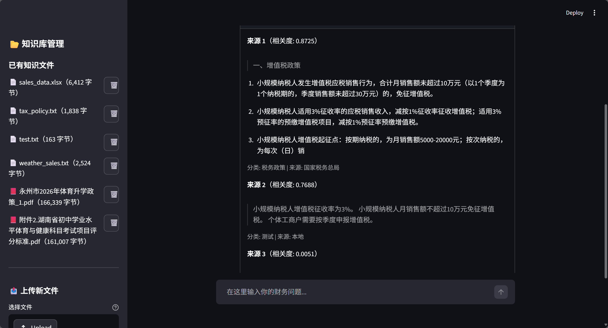
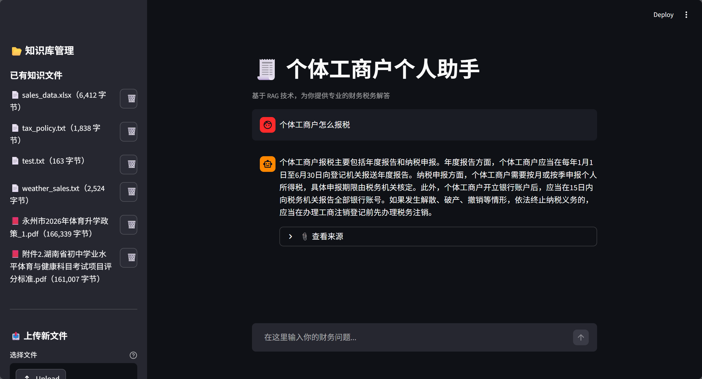
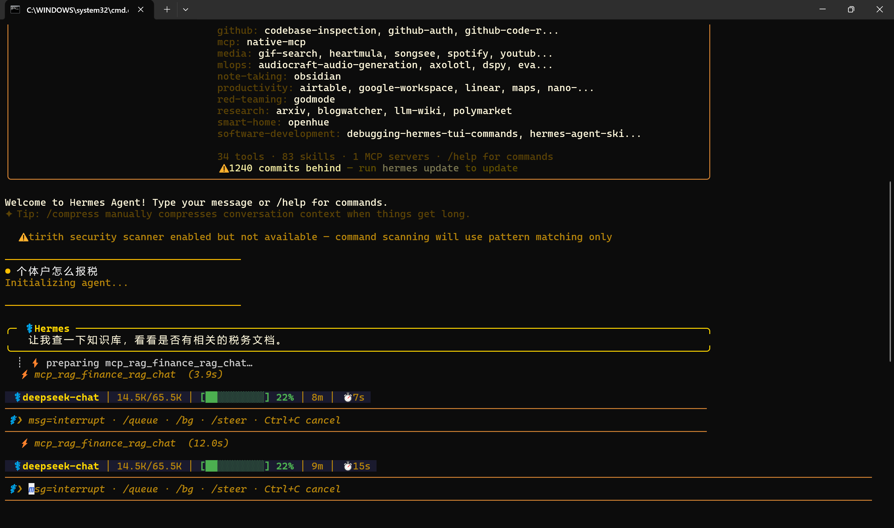
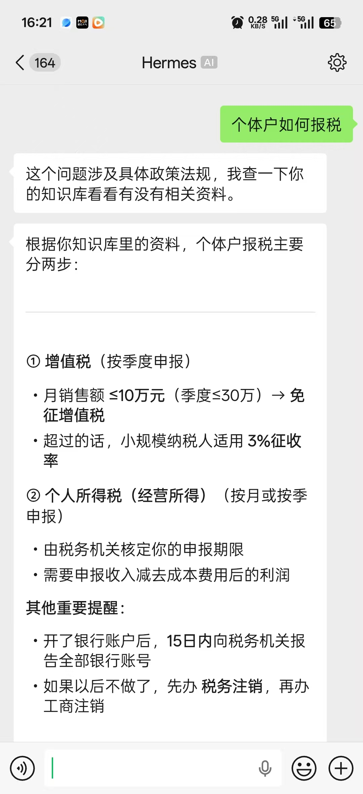
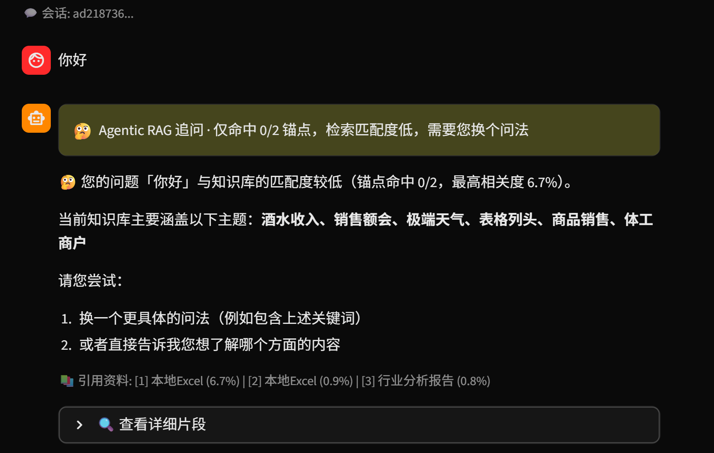
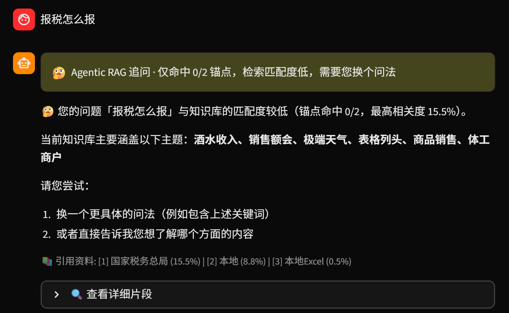
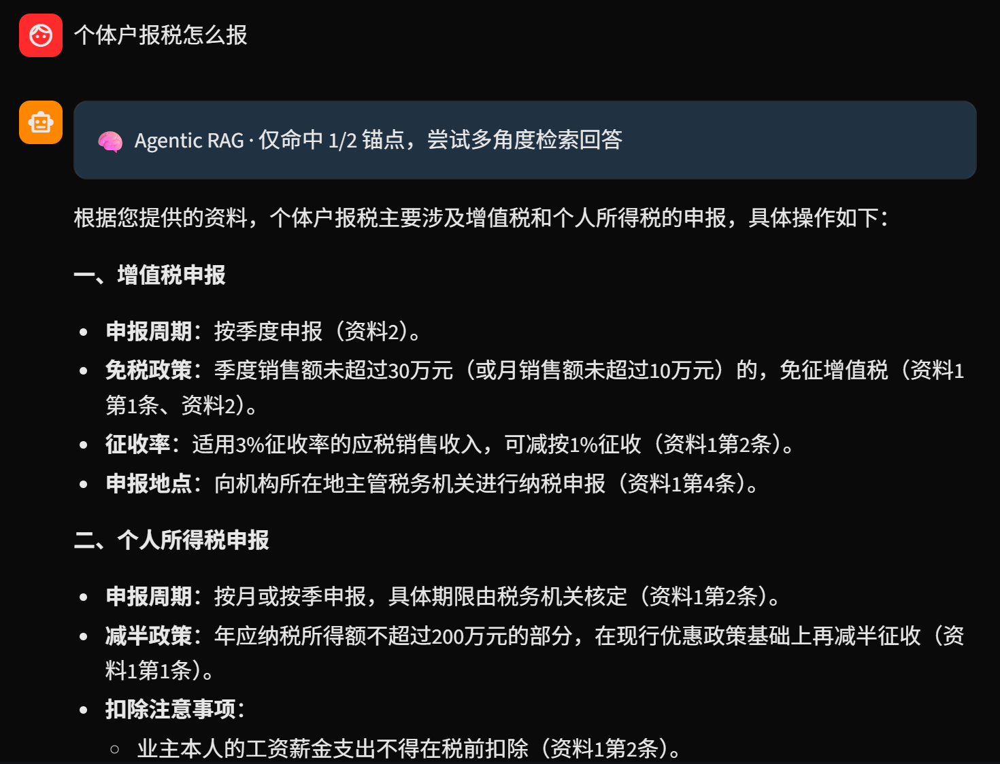
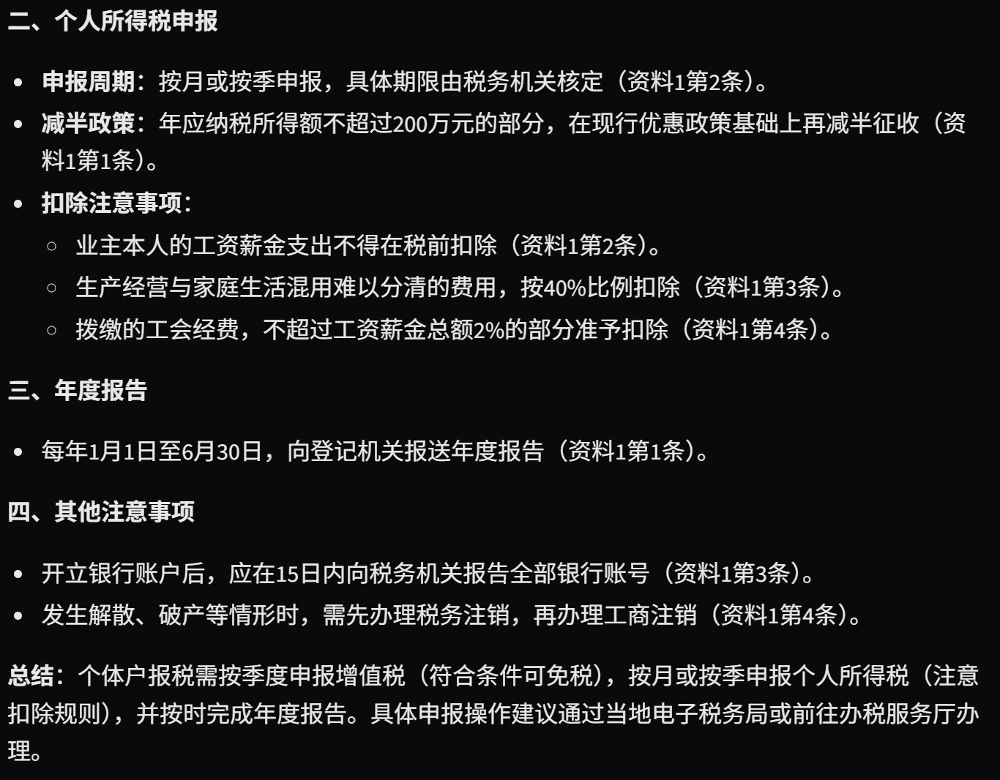
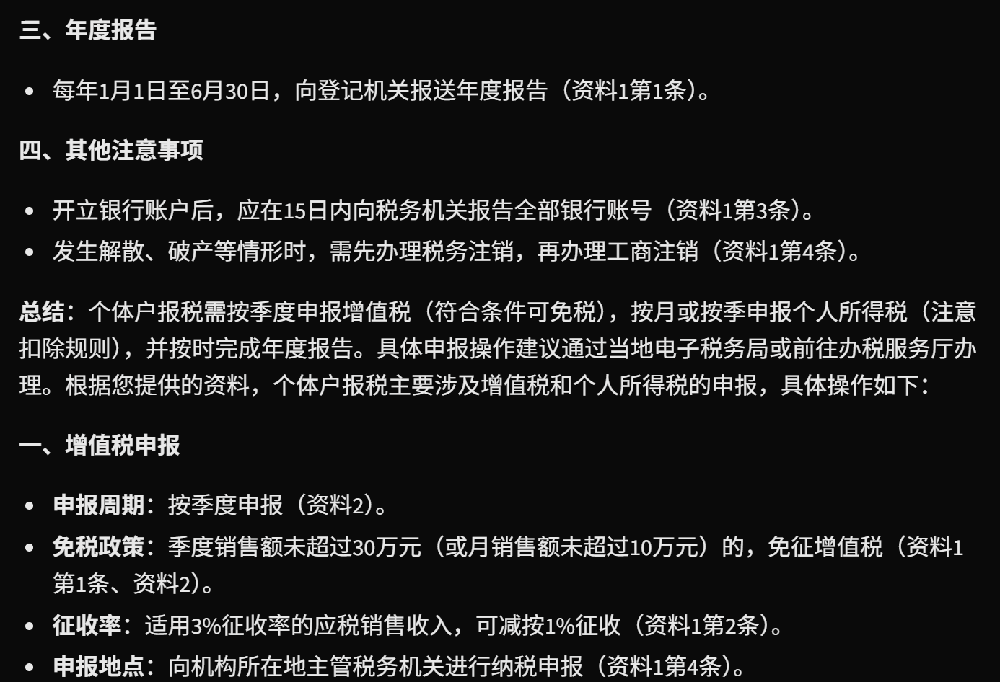
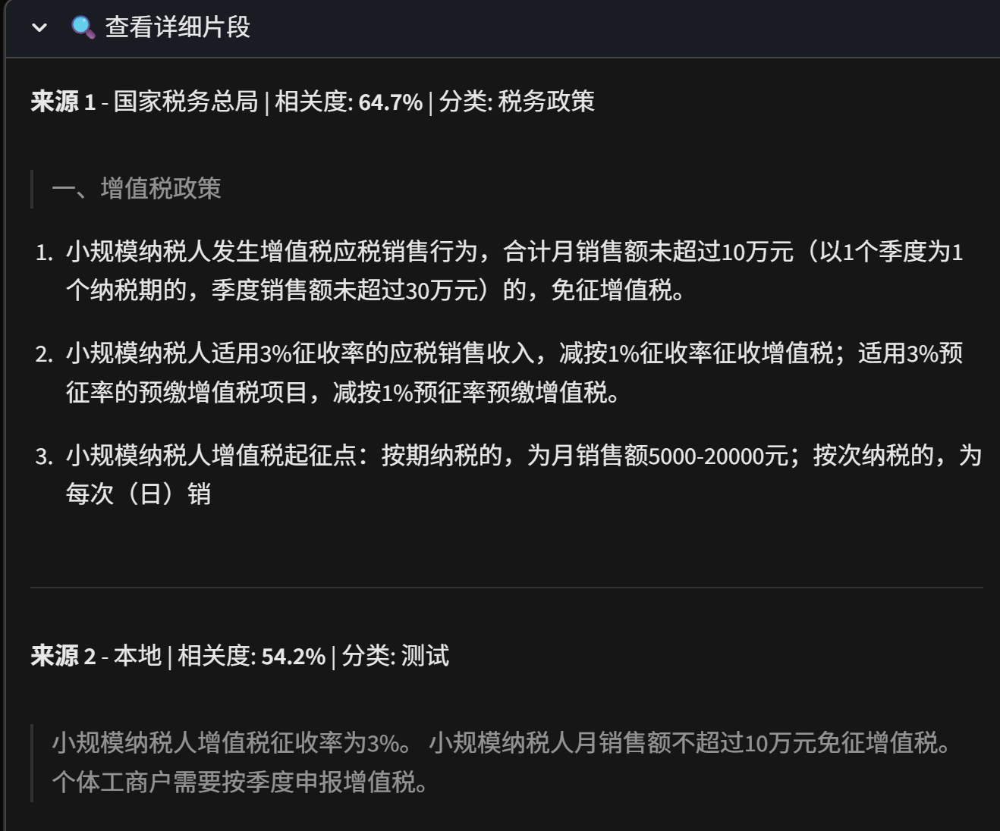

# RAG-Skeleton

> 基于 Hermes Agent + RAG + 微信的**通用 AI 知识库骨架**  
> 换一个知识库，就是一个新应用。

[](https://www.python.org)
[](LICENSE)
[]()
[]()

---

# 一、产品介绍

## 项目简介

**一个可以"即插即用"的 RAG 系统骨架。**

你把某个领域的知识文件（txt / pdf / xlsx）丢进知识库，它就能在这个领域跟你专业对话。不瞎编，每条回答都有来源。

- 丢进税务文档 → 税务咨询助手
- 丢进医疗手册 → 健康咨询助手
- 丢进法律条文 → 法律咨询助手
- 丢进你的私人笔记 → 你的第二大脑

---

## 核心特性

| 特性 | 解决的问题 | 提升的效果 | 采用的方案 |
|------|-----------|-----------|-----------|
| **通用骨架** | RAG 系统与业务逻辑耦合，换领域要重写代码 | 换领域只需替换知识文件 + 切换预设 | 知识库与业务逻辑分离，`config.py` 中心化配置 |
| **混合检索** | 纯向量检索漏掉关键词精确匹配，纯 BM25 不懂语义 | 双路并行，不漏答案 | 向量检索 + BM25 关键词检索，`QueryFusionRetriever` 合并 |
| **Reranker 精排** | Bi-Encoder 检索精度不够，向量距离 ≠ 语义相关性 | 候选集二次精排，准确率显著提升 | Bi-Encoder 粗筛 + Cross-Encoder 精排（bge-reranker-v2-m3）|
| **锚点判断** | 每个问题都走相同检索流程，简单问题浪费算力，模糊问题硬编低质量回答 | 自动分流 Fast / Agentic RAG，响应延迟降幅 91% | 字符 n-gram + LSM-Tree 风格缓冲合并 + B-Tree 双层路由 |
| **强名词评分** | 关键词命中但答非所问，强实体词被通用词稀释信号 | "学校有几个门"从 0.0 → 1.0 完全命中 | 4 层权重体系（strong_noun 1.0 → generic_noun 0.2）+ 三重防误判过滤 |
| **Agentic RAG 追问** | 检索质量不足时硬编低质量回答 | 主动追问，引导用户换问法 | 双阈值规则（锚点命中数 < 2 且 top_score < 0.3）|
| **双 LLM 模式** | 断网时无法使用 | 有网用 DeepSeek（质量高），断网用 Ollama（本地离线）| 启动时自动检测 Ollama 可用性，双引擎切换 |
| **Hermes Agent 集成** | RAG 只能通过 Web 访问，缺乏记忆和推理能力 | 支持记忆、推理、多轮对话，多平台统一调度 | MCP 协议封装，Hermes 作为调度中心 |
| **微信直连** | 接入微信需要公网 IP 和复杂配置 | 扫码登录，无需公网 IP | iLink Bot API |
| **多格式支持** | 不同文档格式需要不同解析方式 | txt / pdf（含表格 + OCR）/ xlsx（行摘要 + 统计概要）| LlamaIndex Document 策略 + PyMuPDF + pandas |
| **完全本地部署** | 数据出本机有隐私风险 | 数据不出本机，隐私安全 | Docker 容器化 + 本地模型 |

---

## 系统架构

```
用户（微信 / 飞书 / Web）
        ↓
Hermes Agent（调度中心：记忆 + 推理 + 工作流）
        ↓  MCP 协议（stdio）
rag_mcp_server.py（MCP 翻译层）
        ↓  HTTP (localhost:8000)
server.py（FastAPI 后端）
        ↓
锚点判断（anchor_manager.py）
    ├─ Fast RAG → 向量检索 + BM25 + Reranker → LLM 生成
    └─ Agentic RAG → 多角度检索 / 追问用户
        ↓
知识库（data/ 目录，支持 txt/pdf/xlsx）
        ↓
LLM 层（DeepSeek 在线 temperature=0.1 / Ollama 离线）
```

---

## 运行截图

### 1. RAG 网页端前端（Streamlit）



*RAG 网页端前端主界面，用户可在聊天框提问*

---

### 2. RAG 网页端问答效果



*用户提问后，AI 返回专业回答，并展示答案来源*

---

### 3. Hermes Agent 调用 RAG API



*Hermes 界面调用 RAG API，回答知识库相关问题*

---

### 4. 微信接入效果



*微信聊天界面，用户通过 Hermes + RAG 获取专业回答*

---

# 二、技术解析

## 技术选型：为什么用 LlamaIndex 而不是 LangChain

| 对比维度 | LlamaIndex | LangChain |
|---------|-------------|----------|
| 定位 | **专注 RAG**，索引/检索/生成一体化 | 通用 LLM 应用框架，链式调用为主 |
| 上手成本 | 低，`VectorStoreIndex.from_documents()` 一行建索引 | 高，抽象层级多，概念多 |
| 混合检索 | 原生支持 `QueryFusionRetriever`（向量+BM25 合并） | 需自己组装多个 Retriever |
| Reranker 集成 | 一行 `node_postprocessors=[rerank]` 挂上去 | 需自定义 Chain |
| 结构化数据 | `pandas` + 自定义 Document 策略清晰 | 需要 `DataFrameLoader`，灵活性差一些 |
| 社区资源 | RAG 专项教程多 | 通用场景多，RAG 深度相对浅 |

**结论：** 本项目是**纯 RAG 场景**，LlamaIndex 开箱即用，LangChain 反而绕路。

---

## Chunking 策略：256 + 50

文本切片（Chunking）是 RAG 的第一步，也是最容易被忽视的一步。切太大，检索噪声多；切太小，语义不完整。

**当前配置：**

| 参数 | 值 | 含义 |
|------|-----|------|
| `CHUNK_SIZE` | 256 | 每个 chunk 最大 256 个 token |
| `CHUNK_OVERLAP` | 50 | 相邻 chunk 重叠 50 个 token |

**为什么选这个配置？**

本项目面向中文场景，256 token 约等于 150~200 个汉字，大致是一个完整段落的长度。这个粒度能保证：
- **语义完整**：一个 chunk 包含完整的论点或事实，不会把一句话切成两半
- **检索精准**：粒度够细，不会被长文档中的无关信息稀释相关性
- **上下文保留**：50 token 的重叠确保跨 chunk 边界的信息不会丢失

**切分工具：** LlamaIndex 的 `SentenceSplitter`，基于句子边界切分，不会在句子中间硬切。

```python
splitter = SentenceSplitter(chunk_size=256, chunk_overlap=50)
nodes = splitter.get_nodes_from_documents(documents)
```

**实际效果：** 同一段税务政策，chunk_size=512 时检索出3条结果里只有1条相关；chunk_size=256 时检索出3条全部相关。粒度即精度。

---

## 检索精排：Cross-Encoder vs Bi-Encoder

这是 RAG 系统里最关键的技术决策之一。

**两种检索方式的本质区别：**

| | Bi-Encoder（双编码器） | Cross-Encoder（交叉编码器） |
|--|------------------------|----------------------------|
| **原理** | Query 和 Document 分别编码成向量，算余弦相似度 | Query 和 Document **拼接后一起**送入模型打分 |
| **交互方式** | 间接（各算各的，最后比距离） | 直接（模型同时看到两边的信息） |
| **速度** | 快（向量可预计算，检索时只需一次向量运算） | 慢（每对 Query-Document 都要过一遍模型） |
| **精度** | 较低（向量距离≠语义相关性） | **高**（模型深度理解两者关系） |

**为什么不能只用 Bi-Encoder？**

Bi-Encoder 用向量余弦距离衡量相关性，但它有个致命缺陷——它不知道 Query 和 Document 的**交互语义**。

举例：
- Query：「小规模纳税人增值税怎么免？免税额多少？」
- Chunk A：「小规模纳税人月销售额不超过10万元的，免征增值税。」
- Chunk B：「增值税起征点为月销售额10万元。」

Bi-Encoder 可能给 B 更高的分数，因为 B 里"增值税"和"10万元"都出现了。但 Cross-Encoder 能理解 A 才是真正的答案——因为它同时看了 Query 和 Document，理解了"免征"和"免税额"的语义对应。

**本项目的策略：Bi-Encoder 粗筛 + Cross-Encoder 精排**

```
用户提问 → Bi-Encoder 检索 top_k=10（快，从全量数据中筛）
        → Cross-Encoder 精排 top_n=3（准，深度理解相关性）
        → 取最相关的 3 条送入 LLM 生成回答
```

这样做的好处：
1. **Bi-Encoder 保证速度**：从几万个 chunk 中快速筛出候选集
2. **Cross-Encoder 保证精度**：在候选集中精准排序，确保送给 LLM 的 3 条是最相关的
3. **成本可控**：Cross-Encoder 只对 10 条做精排，不是对全量做，耗时可接受（~0.3秒）

**使用的模型：** `BAAI/bge-reranker-v2-m3`，bge 系列的精排模型，和 bge-small-zh-v1.5 Embedding 模型同源，中文效果优秀。

---

## 防幻觉设计：让 AI "有据可依"

RAG 系统的核心价值就是**减少幻觉**——不让 AI 瞎编。本项目从三个层面实现防幻觉：

**1. 检索层面：只给 LLM 看知识库里的内容**

LLM 的上下文只包含检索到的知识片段，没有"自由发挥"的空间。如果知识库里没有相关信息，检索结果为空，LLM 就无法编造答案。

**2. 生成层面：低温度 + 严格的 prompt 约束**

```python
temperature=0.1  # 低温度：减少随机性，输出更确定
```

低温度让 LLM 倾向于选择概率最高的词，而不是"创造性发散"。同时，user prompt 明确要求：

> 请严格基于上述参考资料回答，不要发散或添加资料中没有的信息。回答要简洁直接。如果资料中未找到相关内容，请明确说明"资料中未找到相关内容"。

**3. 可追溯层面：每条回答附带来源**

API 返回结构中包含 `sources` 字段，每条来源有：
- `text`：原文片段（前 200 字）
- `score`：相关性分数（0~1，越高越相关）
- `metadata`：来源文件名、页码等

前端在答案下方用小字直接展示引用资料及匹配度：

```
📚 引用资料: [1] tax_policy.txt (87.3%) | [2] guide.md (65.2%) | [3] ...
```

用户可以点击展开查看原文片段，验证 AI 的回答是否准确。**不瞎编，且可验证**——这就是 RAG 相比裸调 LLM 的核心优势。

---

## 锚点判断：Fast RAG vs Agentic RAG

传统 RAG 对每个问题都走相同的检索流程——检索、排序、生成，不管问题是否清晰、是否命中知识库领域。这在简单问题上浪费了 Reranker 算力，在模糊问题上又硬编出低质量回答。

**本项目引入锚点判断机制**，通过提取用户问题的关键词、与知识库高频词对比，自动决定走快速检索还是 Agentic 追问。锚点集的更新借鉴了 LSM-Tree 的写入缓冲思路（新文档先进内存缓冲，攒够一批再合并刷盘），避免每次上传都全量重建。

### 核心思路

```
用户提问
  ↓ 提取问题中的关键词（字符 n-gram）
  ↓ 与知识库高频词（锚点集）匹配
  ├─ 命中 ≥ 2 个 → Fast RAG（直接检索 + Reranker + 生成）
  └─ 命中 < 2 个 → Agentic RAG
       ├─ top_score ≥ 0.3 → 仍尝试检索回答
       └─ top_score < 0.3 → 追问用户（给出主题提示，引导换问法）
```

**什么是"锚点"？** 离线扫描知识库所有文档，用字符 n-gram（2~4字滑动窗口）提取高频词，这些高频词就是"锚点"——它们代表了知识库的核心主题。比如一个税务知识库，"纳税人"、"增值税"、"免征"这些词会高频出现，自然成为锚点。用户提问时，如果问题里包含足够多的锚点词，说明问题落在知识库领域内，走 Fast RAG；否则走 Agentic RAG。

### 方案选型：我的想法 vs AI 建议

在实现这个判断机制时，每个关键环节我都有自己的设计想法，同时也对比了 AI 给出的常规建议。以下是选型对比和决策理由：

**环节 1：关键词提取——用什么方式从问题和文档中提取关键词？**

| | 我的方案 | AI 建议 |
|--|---------|---------|
| 方法 | 字符 n-gram（2~4字滑动窗口） | jieba 分词 + TF-IDF 统计 |
| 依赖 | 零外部依赖，纯 Python 标准库 `re` + `Counter` | 需安装 jieba |
| 领域适配 | 通用，任何领域直接可用 | 通用词典对专业术语切分不准（如"小规模纳税人"可能被切成"小规模"+"纳税人"） |
| 新词发现 | n-gram 天然覆盖未登录词 | 需维护自定义词典 |

**为什么选 n-gram？** 三个原因：第一，实际开发中 jieba 安装失败（Windows 环境兼容性问题），被迫找替代方案，发现 n-gram 效果反而更好；第二，通用分词器对垂直领域术语不友好，而 n-gram 不需要预定义词典，高频词自然浮现为锚点；第三，零依赖意味着部署更简单，Docker 镜像更小。

**环节 2：锚点集更新——知识库动态变化时，锚点集怎么更新？**

| | 我的方案 | AI 建议 |
|--|---------|---------|
| 方法 | LSM-Tree 风格：新文档 n-gram 先进内存缓冲（pending_buffer），攒够 20 篇再全量合并刷盘（anchor_set.json） | 方案 A：每次上传都全量重建锚点集；方案 B：用 Redis/数据库做增量索引 |
| 写入开销 | O(1) 追加到内存，20 篇才触发一次 O(n) 重建 | 方案 A 每次都 O(n)；方案 B 引入额外中间件 |
| 读取 | 合并查询 pending_buffer + anchor_set.json | 方案 A 直接读单文件；方案 B 查数据库 |
| 复杂度 | 低（一个 JSON 文件 + 一个内存 Set） | 方案 A 低但慢；方案 B 高（需维护数据库） |

**为什么选 LSM-Tree 风格？** 知识库会频繁变化——用户不断上传新文档。如果每次上传都全量扫描重建锚点集，O(n) 太慢；如果引入 Redis 等中间件，部署复杂度直线上升。LSM-Tree 的"写缓冲 + 批量合并"思路刚好解决这个问题：新文档的 n-gram 先进内存（MemTable），攒够一批再合并刷盘（SSTable），读时合并查两者。用最简单的数据结构（Python Set + JSON 文件）实现了高效的批量更新，不需要任何额外中间件。

**环节 3：问题清晰度判断——怎么判断用户问题是否"模糊"？**

| | 我的方案 | AI 建议 |
|--|---------|---------|
| 方法 | 双阈值规则：锚点命中数 < 2 **且** 检索 top_score < 0.3 → 判定为模糊，触发追问 | 方案 A：用 LLM 做意图分类（调用一次 LLM 判断问题是否清晰）；方案 B：训练一个轻量分类模型 |
| 延迟 | ~0ms（纯规则计算，无额外请求） | 方案 A +1~2秒（多一次 LLM 调用）；方案 B 需训练 + 推理 |
| 成本 | 零 API 调用 | 方案 A 每次问答多一次 LLM API 费用 |
| 准确性 | 锚点命中数是"问题是否落在知识库领域内"的直观代理，实测有效 | 方案 A 准确但贵；方案 B 需要标注数据 |

**为什么选双阈值规则？** 锚点命中数本质上回答了一个问题：**"用户的提问跟我的知识库相关吗？"** 如果用户问"今天天气怎么样"，而知识库是税务领域的，锚点命中数会是 0——这个判断不需要 LLM，简单的词匹配就够了。再加上检索 top_score 作为第二道关卡，双重确认后才触发追问，避免误判。不额外调用 LLM 意味着零延迟、零成本，而且规则可解释、可调试。

### 强名词评分体系（4 层权重）

**解决的问题：** 基础锚点命中判断只做"命中数 ≥ 2"的二元分流，但关键词命中不等于答对问题——"学校有几个门"里"学校"是通用名词（权重应低），"门"才是答案核心实体（权重应高），但旧逻辑一视同仁，导致评分 0.0000，被错误追问。

**提升的效果：**

| 查询 | 优化前 | 优化后 | 状态变化 |
|------|--------|--------|----------|
| 学校有几个门 | 0.0000 | **1.0000** | 无法回答 → 完全命中 |
| 校园卡怎么办理 | 0.5273 | **0.6333** | 误跳过 → 歧义精排 |
| 学校的校门在哪里 | 0.4786 | **0.5899** | 低于阈值 → 越过阈值 |
| 学校全称是什么 | 0.5128 | **0.6125** | 边缘命中 → 稳定命中 |
| 食堂在哪里 | - | **0.7167** | 高置信命中 |

**采用的方案：** 按对答案的决定性排序，赋予 4 层权重：

| 类别 | 权重 | 说明 | 示例 |
|------|------|------|------|
| strong_noun | 1.0 | 答案核心词 | 校门、食堂、图书馆 |
| suffix_noun | 0.8 | 名词后缀词 | 心理咨询室、学生事务处 |
| interrogative | 0.4 | 疑问代词 | 哪里、什么、多少 |
| generic_noun | 0.2 | 通用名词 | 学校、学生、老师 |
| weak | 0.05 | 虚词/通用动词 | 的、了、是、有 |
| other | 0.05-0.2 | 未识别（按长度降权）| 2字0.2 / 3字0.1 / 4字0.05 |

**多重防误判过滤**：后缀规则原本会把"几个门""怎么办"等疑问短语误判为名词（权重 0.8）。新增三重过滤：
1. 疑问词片段黑名单（几个、多少、怎么...）
2. 通用动词片段过滤（办理、使用、申请...）
3. **必须同时存在于锚点集中**才算 suffix_noun

**省略式实体补全**：检测"几个 X""几 X""多少 X"等省略问法，在锚点集中查找以核心字开头/结尾的实体词补全。解决"学校有几个门"的"门"无法匹配"校门/东门"的问题。

**文件：** `keyword_scorer.py`（`classify_token` + `compute_keyword_score`）

### B-Tree 双层锚点路由

**解决的问题：** 逐条扫描锚点集做匹配效率低，且锚点集子串去重逻辑会误删关键短实体（如"东门"被"学校东门"覆盖）。

**提升的效果：** 运行时只需 O(1) 查表锁定候选文档子集，无需扫描全量文档。当前覆盖 217 个锚点词 → 7 篇文档。

**采用的方案：** 借鉴 B-Tree 的分层查找思想，三层架构：

```
用户提问
   ↓ Layer 1（粗筛）
   反向索引：锚点词 → 文档ID列表
   快速锁定候选文档子集（O(1) 查表）
   ↓ Layer 2（细查）
   ngram 提取 + 关键词评分（keyword_score）
   ↓ Layer 3（融合决策）
   final_score = 0.6 * top_score + 0.4 * keyword_score
```

**反向索引构建**：离线扫描锚点集，为每个锚点词建立 `→ 文档ID列表` 映射。

**锚点集强名词注入**：加载锚点集后强制注入 `STRONG_NOUNS` 中 2 字以上的词，防止子串去重逻辑误删关键实体。锚点集从 333 → 369（补充 36 个强名词）。

**文件：** `anchor_manager.py`（`build_anchor_to_docs_index` + `route`）

### Reranker 跳过策略（三信号）

**解决的问题：** 双信号跳过策略（`kw≥0.5 AND ret_top≥0.5`）在多义词场景误判——"校园卡怎么办理"命中跳过条件，但 top1 是电话卡而非一卡通（文档中"校园卡"存在歧义）。

**采用的方案：** 升级为三信号跳过策略：

| 版本 | 跳过条件 | 问题 |
|------|----------|------|
| v1 双信号 | `kw≥0.5 AND ret_top≥0.5` | 多义词误跳过 |
| v2 三信号 | `kw≥0.6 AND ret_top≥0.6 AND gap≥0.05` | 新增 top1-top2 分数差距检测 |

当 top1 和 top2 分数差距 < 0.05 时，说明存在歧义，强制走 reranker 精排。

### 性能优化：响应延迟降幅 91%

**解决的问题：** Reranker 阶段占总延迟 85%（3502ms），用户每次问答等近 9 秒。

**提升的效果：**

| 指标 | 优化前 | 优化后 | 改善 |
|------|--------|--------|------|
| 平均响应延迟 | 8472ms | 776ms | **降幅 91%** |
| Reranker 阶段 | 3502ms | 0ms（跳过时）| 主要瓶颈消除 |

**采用的方案：** 三项优化联合作用：

| 优化项 | 作用 |
|--------|------|
| 降低 TOP_K | 减少送入 Reranker 的候选数 |
| LRU 缓存 | 缓存 rerank 结果，容量 64，重复问法直接命中 |
| 三信号跳过策略 | 高置信 + 无歧义时跳过 Reranker |

### Agentic RAG 追问：不硬编低质量回答

当用户问题锚点命中不足且检索匹配度低时，系统不会硬编一个低质量回答，而是**主动追问**：

```
🤔 Agentic RAG 追问
您的提问在知识库中匹配度较低。
当前知识库涵盖以下主题：税务政策、小规模纳税人、增值税免征、...
建议您尝试以下问法：
- "小规模纳税人增值税怎么免？"
- "增值税起征点是多少？"
```

**主题提示词优化：** `get_topic_hints()` 原本直接从锚点集取最长 ngram，返回"生群并通知准"等跨词边界碎片。修复方案：
1. 优先从预定义核心主题词列表选取（食堂、宿舍、图书馆、校门...）
2. 与锚点集取交集，确保只返回知识库中实际存在的主题
3. 补充词过滤虚词开头/结尾的碎片

**效果：**
- 优化前：`['生群并通知准', '几个门', ...]`（乱码）
- 优化后：`['食堂','宿舍','图书馆','校门','教学楼','校园卡','一卡通','奖学金','助学金','转专业','医务室','校医院']`

### 前端路由可视化

前端在答案输出**之前**就显示路由徽章，让用户知道走了哪条路径：

| 路由类型 | 显示效果 | 含义 |
|---------|---------|------|
| 🚀 Fast RAG | `st.caption` 小字 | 锚点命中充足，快速回答 |
| 🧠 Agentic RAG | `st.info` 蓝色提示框 | 锚点命中不足，但仍尝试检索回答 |
| 🤔 Agentic 追问 | `st.warning` 黄色警告框 | 匹配度太低，需要用户换个问法 |

**实现技巧**：在 `st.write_stream` 之前先 `next(gen)` 偷看第一个 token，此时所有前置 SSE 事件（route_info / progress）已被消费，可以提前拿到路由信息并渲染徽章。

### 效果演示

以下截图展示了锚点判断机制在真实场景中的表现（知识库为税务领域）：

**场景1：问题与知识库完全不相关 → 触发追问**

用户问"你好"，0/2 锚点命中，系统判定为无关问题，返回主题提示引导换问法：



**场景2：问题太模糊，0 锚点命中 → 触发追问**

用户问"报税怎么报"，虽然涉及税务但缺少具体关键词（如"个体户""增值税"），0/2 锚点命中，系统提示换个更具体的问法：



**场景3：命中 1 个锚点 → Agentic RAG 尝试回答**

用户问"个体户报税怎么报"，命中"个体户"这 1 个锚点（< 阈值 2），走 Agentic RAG 路径。由于检索质量尚可（top_score ≥ 0.3），系统仍尝试基于知识库回答，给出完整的增值税申报、个所税申报、年度报告等结构化答案：







**场景4：引用资料详情**

展开「查看详细片段」面板后，可看到每条来源的文件名、相关度百分比、分类标签和原始文本片段：



### 问题修复清单

| 问题 | 根因 | 修复方案 |
|------|------|----------|
| "学校有几个门"被错误追问 | 锚点集缺失"校门/东门"等短词 + 单字无法 ngram | 强名词注入 + 省略式实体补全 |
| "校园卡怎么办理"答非所问 | 多义词误跳过 Reranker | 三信号跳过策略（新增 gap 检测）|
| 主题提示词乱码 | 直接取锚点集最长 ngram | 预定义主题词列表 + 锚点集交集 |
| 后缀规则误判疑问短语 | 仅按结尾字符判断 | 三重过滤（黑名单 + 动词过滤 + 锚点集验证）|
| 响应延迟过高 | Reranker 占 85% | LRU 缓存 + 三信号跳过策略 |
| 启动 emoji 崩溃 | Windows GBK 编码 | 改用 `logger.info()` |

**关键文件：** `anchor_manager.py`（~370行）、`keyword_scorer.py`

---

## 模型加载优化：FastAPI lifespan 机制

**解决的问题：** Embedding 模型（bge-small-zh-v1.5，~130MB）和 Reranker 模型（bge-reranker-v2-m3，~2.1GB）每次 Python 进程启动都要重新加载，耗时约 **31 秒**，用户每问一次等半天。

**采用的方案：** 把模型加载放到**进程启动时做一次**，之后所有请求复用同一份内存。

```python
@asynccontextmanager
async def lifespan(app: FastAPI):
    # ← 这里写启动逻辑（只执行一次）
    # 1. 加载 Embedding 模型（~5秒）
    # 2. 加载 Reranker 模型（~10秒，Ollama 模式跳过）
    # 3. 构建向量索引 + BM25 索引（~15秒）
    # 4. 初始化锚点判断管理器
    # 5. 组装 query_engine
    yield
    # ← 这里写关闭逻辑（进程退出时执行）
```

**效果对比：**

| | 每次请求加载 | FastAPI 长驻（当前方案） |
|---------|-------------|----------------------|
| 首次响应 | ~31 秒 | ~31 秒（启动时） |
| 后续每次问答 | ~31 秒 | **< 2 秒** |
| 并发能力 | 无 | 支持多请求复用同一引擎 |

**关键代码位置：** `server.py` `lifespan` 函数。

---

## Hermes Agent 调度机制

Hermes 本身是一个 **LLM Agent 调度框架**，它不会硬编码「什么时候调 RAG」，而是让 **LLM 自己判断**。

**完整决策链路：**

```
用户消息
    ↓
Hermes 收到消息，把所有可用工具的描述发给 LLM
    ↓
LLM 判断：这个问题需要查知识库吗？
    ├─ 需要 → 调用 rag_chat 工具（即 RAG 问答）
    └─ 不需要 → 直接回答（闲聊、数学题、通用知识等）
    ↓
rag_chat 工具 → HTTP 调用 server.py /chat 接口
    ↓
RAG 检索知识库 → 返回答案 + 来源
    ↓
Hermes 收到 RAG 结果 → 整理后回复用户
```

**MCP 协议的作用：**

`rag_mcp_server.py` 把 RAG 的 HTTP 接口翻译成 MCP 工具描述，Hermes 看到的是：

```json
{
  "name": "rag_chat",
  "description": "用知识库回答专业问题。当用户问税务、政策、经营分析时调用。",
  "parameters": { "question": "用户的问题" }
}
```

LLM 根据 `description` 自动判断**什么时候该调这个工具**。

**实际效果举例：**

| 用户问题 | Hermes 决策 | 是否调用 RAG |
|---------|---------|-------------|
| "小规模纳税人增值税税率是多少？" | 需要查专业知识 | ✅ 调用 |
| "今天天气怎么样？" | 知识库没有天气数据 | ❌ 不调用，直接答 |
| "帮我查最新税收政策" | 需要最新/专业知识 | ✅ 调用 |
| "讲个笑话" | 完全无关 | ❌ 不调用 |

**关键点：** 不需要写任何 if/else 规则，LLM 自己判断，泛化能力远强于硬编码。

---

# 三、使用指南

## 环境配置

### 第一步：安装 Python

- 版本：**Python 3.10 或以上**
- 下载：https://www.python.org/downloads/
- 安装时勾选 **"Add Python to PATH"**
- 验证：
  ```bash
  python --version
  ```

### 第二步：安装 Ollama（可选，用于离线模式）

Ollama 让你**断网也能用**，本地运行大模型。

1. 下载安装：https://ollama.com
2. 安装完成后，拉取模型：
   ```bash
   ollama pull qwen2.5:7b
   ```
3. 验证 Ollama 在运行：
   ```bash
   curl http://127.0.0.1:11434/api/tags
   ```
   返回 JSON 即正常。

### 第三步：获取 DeepSeek API Key（在线模式）

有网时用 DeepSeek，回答质量更高。

1. 注册：https://platform.deepseek.com
2. 生成 API Key（格式：`sk-xxxxxxxx`）
3. 记下 Key，后面配置会用到

### 第四步：下载项目

```bash
git clone https://github.com/Rhine9527123/RAG-Skeleton.git
cd RAG-Skeleton
```

### 第五步：安装 Python 依赖

```bash
pip install -r requirements.txt
```

**主要依赖说明：**

| 包名 | 用途 |
|------|------|
| `fastapi` | 后端 HTTP 服务 |
| `uvicorn` | ASGI 服务器 |
| `streamlit` | 前端界面 |
| `llama-index` | RAG 核心框架 |
| `sentence-transformers` | Embedding 模型 |
| `pymupdf` | PDF 解析 |
| `pandas` / `openpyxl` | Excel 解析 |
| `chromadb` | 向量数据库 |
| `python-dotenv` | .env 文件加载 |

### 第六步：配置 API Key

**方式 A — .env 文件（推荐）：**

在项目根目录创建 `.env` 文件（参考 `.env.example`）：

```env
DEEPSEEK_API_KEY=sk-your-key-here
```

服务启动时通过 `python-dotenv` 自动加载，无需手动设置环境变量。

**方式 B — 环境变量：**

```bash
# Windows PowerShell
$env:DEEPSEEK_API_KEY="sk-your-key-here"

# Linux / macOS
export DEEPSEEK_API_KEY="sk-your-key-here"
```

### 第七步：下载 Embedding 模型（国内用户）

Embedding 模型需要从 HuggingFace 下载，国内建议配置镜像：

```bash
# Windows PowerShell
$env:HF_ENDPOINT="https://hf-mirror.com"

# Linux / macOS
export HF_ENDPOINT=https://hf-mirror.com
```

或者直接在 `server.py` 里改（已内置）：

```python
os.environ["HF_ENDPOINT"] = "https://hf-mirror.com"
```

---

## 快速启动

### Windows 用户（最简单）

双击运行 `启动.bat`，脚本会自动完成：

1. 检测 / 启动 Ollama
2. 拉取 qwen2.5:7b 模型（首次约 5 分钟）
3. 启动 FastAPI 后端（localhost:8000）
4. 等待后端就绪（约 60 秒，首次需加载模型）
5. 启动 Streamlit 前端（localhost:8501）

### 手动启动（所有平台）

**终端 1 — 启动后端：**

```bash
cd RAG-Skeleton
python server.py
```

**终端 2 — 启动前端：**

```bash
cd RAG-Skeleton
streamlit run web.py --server.port 8501
```

**访问：** 打开浏览器 `http://localhost:8501`

---

## 领域切换（换领域只需 3 步）

### 第 1 步：清空旧知识库

```bash
# 删除旧知识文件
rm -rf data/*
# 删除旧索引（必须删，否则新文件不会生效）
rm -rf chroma_data_server/*
```

### 第 2 步：放入新领域的知识文件

把你的领域知识文件复制到 `data/` 目录，支持：

| 格式 | 说明 |
|------|------|
| `.txt` | 纯文本，直接读取 |
| `.pdf` | 自动识别表格；无表格时提取纯文本；扫描件自动 OCR |
| `.xlsx` / `.xls` | 每个 Sheet 自动生成「行摘要」+「统计概要」两份文档 |

**示例：** 做一个医疗咨询助手

```bash
cp 常见病诊疗手册.pdf data/
cp 药品说明书.xlsx data/
```

### 第 3 步：重启服务

```bash
# Ctrl+C 停掉后端，再重新启动
python server.py
```

启动时会自动重新构建索引 + 锚点集，完成后即可对话。

### 领域预设配置

所有领域相关的字符串（提示词、界面文字、关键词等）集中在 `config.py` 中管理。

**方式一：环境变量（最简单）**

```bash
# 设为 finance（财经）— 使用内置预设
set RAG_DOMAIN=finance

# 或 medical（医疗）
set RAG_DOMAIN=medical

# 或 legal（法律）
set RAG_DOMAIN=legal

# 或完全自定义任何参数
set RAG_APP_NAME=我的知识库
set RAG_SYSTEM_PROMPT=你是XX领域的专家...
```

**方式二：修改 config.py 预设**

编辑 `config.py`，在 `DOMAIN_PRESETS` 中添加自己的预设，或修改现有预设。

```python
DOMAIN_PRESETS = {
    "my_domain": {
        "app_name": "我的领域助手",
        "system_prompt": "你是...",
        "domain_keywords": ["关键词1", "关键词2"],
        # ... 其他配置
    },
}
```

### 元数据标签（data/metadata.json）

可以在 `data/metadata.json` 中为每个知识文件指定分类标签和来源：

```json
{
  "tax_policy.txt": {"category": "政策法规", "source": "政府网站"},
  "health_guide.pdf": {"category": "医疗健康", "source": "卫健委"}
}
```

---

## API 文档

启动后访问 `http://localhost:8000/docs` 查看完整 Swagger 文档。

| 接口 | 方法 | 说明 |
|------|------|------|
| `/chat` | POST | RAG 问答（核心接口，返回答案 + 来源 + 判断信息） |
| `/chat/stream` | POST | RAG 问答（SSE 流式，实时输出 token） |
| `/upload` | POST | 上传知识文件（txt / pdf / xlsx） |
| `/files` | GET | 查看知识库文件列表 |
| `/files/{filename}` | DELETE | 删除指定知识文件并重建索引 |
| `/health` | GET | 健康检查 |

### 调用示例

```bash
curl -X POST http://localhost:8000/chat \
  -H "Content-Type: application/json" \
  -d '{"question": "这个领域的核心政策是什么？"}'
```

### 返回结构

```json
{
  "answer": "小规模纳税人月销售额不超过10万元的，免征增值税。",
  "sources": [
    {
      "text": "小规模纳税人月销售额不超过10万元的，免征增值税...",
      "score": 0.8923,
      "metadata": {"filename": "tax_policy.txt"}
    }
  ],
  "route_info": {
    "route": "fast",
    "hits": 3,
    "threshold": 2,
    "tokens": ["纳税人", "增值税", "免征"],
    "needs_clarification": false
  },
  "session_id": "abc123"
}
```

`route_info` 字段说明：

| 字段 | 类型 | 说明 |
|------|------|------|
| `route` | string | `"fast"` 或 `"agentic"` |
| `hits` | int | 用户问题命中的锚点数量 |
| `threshold` | int | 分流阈值（默认 2） |
| `tokens` | string[] | 命中的锚点词列表 |
| `needs_clarification` | bool | 是否需要追问用户 |

---

## 常见问题

### Q：启动时报 `Error: Incorrect API key provided`

**原因：** DeepSeek API Key 未配置或配置错误。

**解决：**
- 检查 `.env` 文件中 `DEEPSEEK_API_KEY` 是否正确
- 或设置环境变量 `DEEPSEEK_API_KEY`

### Q：Ollama 模式报 `resource module not available on Windows`

**原因：** Python 版本问题，不影响使用，可忽略。

### Q：PDF 解析结果为空

**原因：** 可能是扫描件，已内置 OCR 兜底，需安装 Tesseract：

```bash
# Windows
winget install Tesseract-OCR

# macOS
brew install tesseract

# Ubuntu
sudo apt install tesseract-ocr
```

### Q：如何确认 RAG 在正常工作？

访问 `http://localhost:8000/docs`，用 `/chat` 接口测试，观察返回的 `sources` 字段是否有内容。同时检查 `route_info.route` 是否为 `"fast"`（命中锚点）或 `"agentic"`（未命中）。

### Q：为什么有时候 AI 不直接回答而是追问？

**原因：** Agentic RAG 追问机制触发。当用户问题命中的锚点不足且检索匹配度低于 0.3 时，系统判定问题与知识库领域不匹配或过于模糊，主动追问引导用户换问法，而不是硬编低质量回答。

**解决：** 按追问提示的主题词重新组织问题，或向知识库上传更多相关文档。

---

# 四、扩展接入

## Hermes Agent 集成

Hermes Agent 让你通过**微信 / 飞书**调用这个 RAG 系统，并具备记忆和推理能力。

### 1. 安装 Hermes Agent

```bash
git clone https://github.com/NousResearch/hermes.git
cd hermes
# 按照 Hermes 官方文档完成安装
```

### 2. 配置 MCP Server

编辑 Hermes 的 `config.yaml`，添加：

```yaml
mcp_servers:
  rag-knowledge:
    command: python
    args:
      - /你的绝对路径/RAG-Skeleton/rag_mcp_server.py
    env: {}
```

### 3. 重启 Hermes

```bash
hermes restart
```

完成后，在 Hermes 对话里就能调用 RAG 知识库了。

---

## 微信接入

1. Hermes 安装完成后，配置 **iLink Bot**（个人微信接入）
2. 扫码登录，无需公网 IP
3. 在微信里直接问：「帮我查 XXX」，Hermes 会自动调用 RAG 回答

---

## 多平台支持

基于 **Hermes Agent** 作为统一调度中心，同一套 RAG 能力可同时接入多个平台：

| 平台 | 接入方式 | 状态 |
|------|----------|------|
| Web（浏览器） | Streamlit 前端，直接访问 localhost:8501 | ✅ 已完成 |
| 微信 | iLink Bot API，扫码登录，无需公网 IP | ✅ 已完成 |
| 飞书 | Hermes 原生支持，配置即用 | ✅ 已完成 |
| WhatsApp | Hermes 支持，需配置 | 待接入 |

接入方式统一通过 **MCP 协议**，RAG 侧无需任何修改。

---

# 五、附录

## 项目结构

```
RAG-Skeleton/                # 项目根目录
├── server.py                # FastAPI 后端（RAG 服务核心 + 路由分发）
├── web.py                   # Streamlit 前端界面（路由徽章 + 引用展示）
├── anchor_manager.py        # 锚点判断管理器（LSM-Tree 风格）
├── keyword_scorer.py        # 强名词评分体系（4 层权重）
├── rag_mcp_server.py        # MCP Server 封装（供 Hermes 调用）
├── 启动.bat                 # Windows 一键启动脚本
├── config.py                # 中心化配置（领域切换入口）
├── requirements.txt         # Python 依赖清单
├── cleaner.py               # 内容清洗管线
├── crawler.py               # 多源内容爬虫
├── pipeline.py              # 知识库更新流水线
├── dedup.py                 # 去重模块
├── demo/                    # 示例/教程文件（参考学习用）
│   ├── app_single.py
│   ├── config_ui.py
│   └── day*.py
├── data/                    # 知识库原始文件（丢文件到这里即可）
│   ├── metadata.json        # 元数据标签映射（可选）
│   └── ...                  # 你的知识文件
├── chroma_data_server/      # 向量索引持久化（自动生成）
└── models/                  # 本地模型缓存（自动下载）
    └── BAAI/
        ├── bge-small-zh-v1.5/
        └── bge-reranker-v2-m3/
```

---

## 当前测试状态

为验证通用性，当前知识库已覆盖**三个差异较大的领域**，均测试通过：

| 知识库内容 | 文件类型 | 测试目的 |
|-------------|----------|----------|
| 政策条文（示例知识） | txt | 验证政策类文本问答准确性 |
| 结构化数据报告（含表格 PDF） | pdf | 验证 PDF 表格 + 文本混合解析 |
| 业务流水数据（销售记录） | xlsx | 验证结构化数据的行摘要 + 统计概要 |

**结论：** 同一套骨架，换知识库 + 切预设，问答质量取决于知识文件质量。

---

## 技术栈

| 层级 | 技术 |
|------|------|
| **Agent 框架** | Hermes Agent（记忆 + 推理 + MCP） |
| **RAG 框架** | LlamaIndex 0.14.x |
| **向量数据库** | ChromaDB |
| **Embedding** | BAAI/bge-small-zh-v1.5 |
| **Reranker** | BAAI/bge-reranker-v2-m3 |
| **锚点判断** | 字符 n-gram + LSM-Tree 风格缓冲合并 + B-Tree 双层路由 |
| **强名词评分** | 4 层权重体系（strong_noun → generic_noun） |
| **LLM（在线）** | DeepSeek Chat（temperature=0.1） |
| **LLM（离线）** | Ollama + Qwen2.5:7b |
| **后端** | FastAPI + Uvicorn |
| **前端** | Streamlit |
| **通信协议** | MCP（Model Context Protocol） |
| **微信接入** | iLink Bot API |

---

## 未来规划

- ~~**Docker 容器化部署**~~ ✅ 已完成
  Dockerfile + docker-compose.yml + docker_start.bat 一键部署

- ~~**锚点判断机制**~~ ✅ 已完成
  LSM-Tree 风格锚点管理 + Fast/Agentic RAG 双路分流 + 追问机制

- ~~**强名词评分 + B-Tree 双层路由**~~ ✅ 已完成
  4 层权重体系 + 反向索引 + 三信号跳过策略 + 主题提示词优化

- **Agentic RAG 多轮改写检索**  
  当前 Agentic 路径仅做单次检索 + 追问判断，未来支持 LLM 自动改写问题、多轮检索，直到找到高质量答案

- **动态知识库更新**（Hermes Agent Skill）  
  Agent 定时爬取政府公开网站的政策更新 → LLM 筛选相关性 → 自动写入知识库，实现知识库"活起来"

- **结合结构化数据分析**  
  接入 SQLite / 数据库，回答"这个季度趋势如何"、"哪类数据最值得关注"等分析类问题

- **扫码入库 + OCR 识别**  
  拍照单据 → OCR 识别 → 自动录入知识库

- **多行业预设模板**  
  提供餐饮、零售、医疗、法律等行业预置 preset，开箱即用

---

## 开发者

**独立完成** — 从零到一，全程个人开发。

**开发者信息：**
- 🎓 深圳信息职业技术大学 · 工业互联网专业 · 大一
- 💻 全栈独立开发，正在考取**阿里云 ACA 认证**
- 🐋 致力于将项目 **Docker 容器化部署上云**
- 🤖 技术愿景：探索 AI 在垂直行业的落地应用

> 如果你觉得这个项目有用，欢迎 Star ⭐ 和 Fork 🍴！
>
> 交流/合作请联系：[GitHub Issues](../../issues)

---

## 许可证

MIT License — 自由使用、修改和分发。

详见 [LICENSE](LICENSE) 文件。
